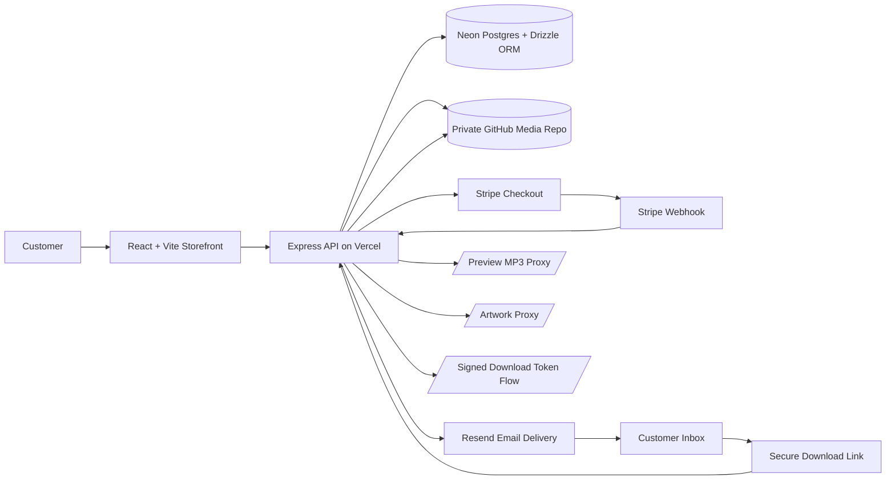

# BeatPlug Code Showcase

Public, recruiter-friendly code samples from **BeatPlug**, a private commercial beat marketplace built with **React + Vite**, **Express on Vercel**, **Neon Postgres**, **Stripe**, **Resend**, and a **private GitHub-backed media storage layer**.

> The full production repository stays private to protect a monetized product, media assets, delivery flows, and business-specific implementation details. This showcase repo contains curated, sanitized source files copied from the private codebase to demonstrate architecture, code quality, and full-stack decision making.

## Architecture

A standalone Mermaid source file also lives in [`docs/beatplug-pipeline.mmd`](docs/beatplug-pipeline.mmd).

## What This Repo Demonstrates

- **Private media proxying** from a GitHub repository instead of public object storage URLs
- **Tokenized digital delivery** for purchased masters
- **Stripe webhook reconciliation** with idempotency and server-side amount validation
- **Frontend catalog state management** for searching, filtering, and paginated beat loading
- **Schema design** for beats, carts, orders, and digital fulfillment

## Best Files To Review First

- [`snippets/backend/github-media-proxy.ts`](snippets/backend/github-media-proxy.ts)
- [`snippets/backend/secure-downloads.ts`](snippets/backend/secure-downloads.ts)
- [`snippets/backend/stripe-webhook-fulfillment.ts`](snippets/backend/stripe-webhook-fulfillment.ts)
- [`snippets/backend/catalog-query.ts`](snippets/backend/catalog-query.ts)
- [`snippets/frontend/home-catalog-feed.tsx`](snippets/frontend/home-catalog-feed.tsx)
- [`snippets/frontend/beat-card.tsx`](snippets/frontend/beat-card.tsx)
- [`snippets/shared/schema.ts`](snippets/shared/schema.ts)

## Stack

- React
- Vite
- TypeScript
- Express
- Vercel Serverless
- Neon PostgreSQL
- Drizzle ORM
- Stripe
- Resend
- GitHub API

## Why The Main Repo Is Private

BeatPlug is a personal commercial project. The private production repository contains:

- proprietary storefront code and product configuration
- full monetization flows and business-specific rules
- private media asset paths and repository structure
- deployment internals and environment configuration
- content/assets intended for commercial use

This public repo is meant to give technical reviewers enough real code to assess:

- architecture choices
- API design
- code organization
- state management
- security-minded delivery patterns
- integration quality across frontend, backend, payments, storage, and email

## Included Snippet Categories

### Backend

- GitHub-backed media path normalization and candidate resolution
- Secure download link generation and token verification
- Stripe webhook processing and order finalization
- Catalog query logic and client-safe asset remapping

### Frontend

- Catalog feed state management with deduped pagination
- Beat card purchase UI, preview playback wiring, and license gating

### Shared

- Drizzle schema for beats, carts, orders, and producers

## Omitted On Purpose

- environment variables and secrets
- full deployment configuration
- private media assets
- complete business logic and content libraries
- internal admin tooling and full application source

## Portfolio Framing

BeatPlug is a full-stack digital beat marketplace with automated checkout, webhook-driven order fulfillment, private media streaming, and secure post-purchase file delivery.
